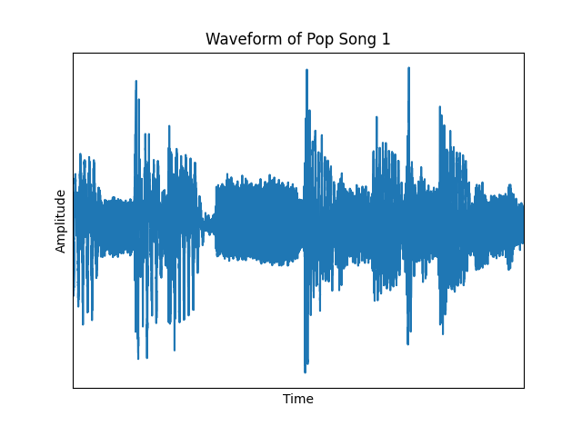
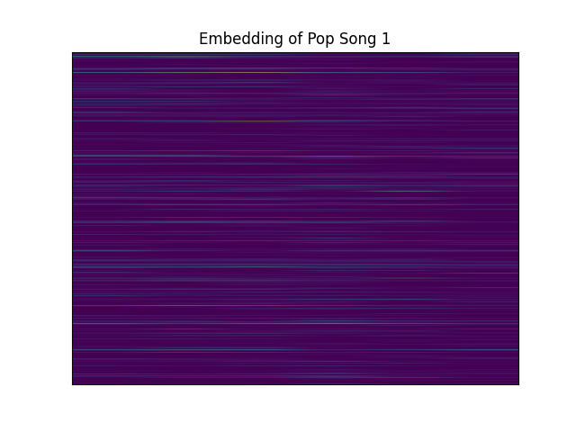

# MusicGenreClassification

This repository contains the code and resources for a project that aims to identify the music genre based on sampled audio data. The project explores the effectiveness of various models on different inputs from the audio, including an LSTM-based model, a CNN-type model, and a combination of LSTM and CNN parallel model.

## Dataset
The dataset that I am utilizing for this project is the GTZAN dataset which includes approximately 30s clips from music of various genres with 100 samples per genre. The clips are classified as only one of the following genres:
-	Blues
-	Classical
-	Country
-	Disco
-	Hip-hop
-	Jazz
-	Metal
-	Pop
-	Reggae
-	Rock

I am using the dataset through https://www.kaggle.com/carlthome/gtzan-genre-collection where each sample file is in .au file format to save on storage space since .au files are lower quality when compared to a .wav format for example.

The dataset should be saved in the [data/music/](data/music/) folder with each genre having its own folder containing the samples.

## Preprocessing
### Waveforms
Loads the samples with a default sample rate of 16kHz. Since the samples were 30s long, they were split into smaller sizes so the models could have an easier time with them. I broke the samples from 30s into 3s long samples. The samples were not all exactly 30s long, if longer (even by milliseconds), it was cut to exactly 30s. If a sample was too short, it was padded with silence. After padding, I had 48000 amplitude values per small sample.

An example of what the waveform for one of these shortened samples is shown below

### Embeddings
Used the YAMNet machine learning model (which is a classifier for various noises, https://tfhub.dev/google/yamnet/1 for more information) in order to obtain embeddings of the audio. These embeddings have the shape of (N, 1024). N is the number of audio frames used which are 0.96 seconds long every 0.48 seconds. For my data, this shape ended up being (6, 1024).

A graphical representation of what one of these embeddings for a sample looks like is given below

### Spectrograms

The YAMNet model also returns the log mel-scale spectrogram of the audio as well, which is what the YAMNet model itself trains on. This scale is no longer the amplitude/loudness of the audio but is instead the frequency of the audio over time. The log mel-scale also changes the values to a similar manner to how humans perceive sound since the ear is not on a linear scale, more of a logarithmic one (http://practicalcryptography.com/miscellaneous/machine-learning/guide-mel-frequency-cepstral-coefficients-mfccs/). 

The shape of the spectrogram is (N, 64). N is again the audio frame used but this case they are 0.025 seconds long and every 0.01 seconds. For my data, this shape ended up being (336, 64).

A graphical representation of what the spectrogram looks like for a sample is given below

### MFCCs
Also calculated 20 MFCCs per time frame as well with these time frames not measured explicitly in seconds but are instead 2048 samples long every 512 samples. So, for this data which was 48000 samples long, the shape became (94, 20).

A graphical representation of what the MFCCs looks like for a sample is given below

### Splits
Since the dataset did not have splits for training and testing by default, split the data into an 80% training set and 20% validation set. Further, the training set was split again into 80% training and 20% testing for the models explained below.

### Labels
Since the current labels were in string format, transformed them into one-hot-encoding format to feed into the models.

## Models
### LSTM and CNN models
Since all of the features are in a time-series format, utilized LSTM model. Two Bi-Directional-LSTM layers that had dropout in an attempt to prevent some overfitting. Batch normalization after each LSTM layer as well. Dense layer with ReLU before a final softmax dense layer for the final prediction. Loss metric was categorical cross entropy.

A CNN model was also used to compare against. The MFCCs and spectrograms worked for a 2D CNN model but the embeddings were more suited for a 1D CNN model. The same types of layers were used but the 2D CNN model was bigger since it is more complex than a 1D model.

The parameters beyond this were not changed between runs, just the inputs given.

### Combined model
A parallel learning model was also tested where it can have multiple types of inputs and different sub-models within it. Basically just combined every input and model together into one and see how it performed.

## Results
Each model had exactly 30 epochs to train and the best epoch was saved and used for the results below.

The results of the models on the validation set which is 20% of the dataset is given in the table below. Only the accuracy is shown here.

|           Model            | Validation Accuracy |
| :------------------------: | :-----------------: |
|          CNN MFCC          |        0.75         |
|      CNN Spectrogram       |        0.32         |
|       CNN Embedding        |        0.81         |
|         LTSM MFCC          |        0.59         |
|      LSTM Spectrogram      |        0.60         |
|       LSTM Embedding       |        0.77         |
| Combined (No Spectrograms) |        0.81         |

For just training for the 30 epochs exactly, the YAMNET embeddings ended up working the best with the CNN model. The combined model was also quite good but it was slower for about the same accuracy. 

It's possible if more epochs were given, then some of the other models would've done better than they did (but I was too lazy to wait around for them in this small-ish test).

See [main.ipynb]() for more results such as the models' accuracies over training and more thourough validation statistics.
